# EcoWatch-F Clean Entity Relationship Diagram

## Visual ERD with Relationship Notation

```mermaid
erDiagram
    %% Core User Management
    users ||--o{ reports : "creates (1:N)"
    users ||--o{ photos : "uploads (1:N)"
    users ||--o{ notifications : "receives (1:N)"
    users ||--o{ report_upvotes : "votes (1:N)"
    users ||--o{ report_updates : "creates (1:N)"
    users ||--o{ report_flags : "flags (1:N)"
    users ||--o{ announcement_reactions : "reacts (1:N)"
    users }o--|| lgus : "belongs_to (N:1)"
    
    %% LGU Management
    lgus ||--o{ barangays : "has (1:N)"
    lgus ||--o{ reports : "assigned_to (1:N)"
    lgus ||--o{ users : "employs (1:N)"
    lgus ||--o{ public_announcements : "publishes (1:N)"
    
    %% Location Hierarchy
    barangays }o--|| lgus : "belongs_to (N:1)"
    barangays ||--o{ reports : "located_in (1:N)"
    
    %% Report Classification
    violation_types ||--o{ reports : "categorizes (1:N)"
    
    %% Reports (Main Entity)
    reports }o--o| users : "reported_by (N:0..1)"
    reports }o--|| violation_types : "has_type (N:1)"
    reports }o--o| barangays : "located_in (N:0..1)"
    reports }o--o| lgus : "assigned_to (N:0..1)"
    reports ||--o{ photos : "has (1:N)"
    reports ||--o{ notifications : "triggers (1:N)"
    reports ||--|| report_validity : "has (1:1)"
    reports ||--o{ report_updates : "has (1:N)"
    reports ||--o{ report_upvotes : "receives (1:N)"
    reports ||--o{ report_flags : "receives (1:N)"
    
    %% Supporting Tables
    photos }o--|| reports : "belongs_to (N:1)"
    photos }o--o| users : "uploaded_by (N:0..1)"
    
    notifications }o--|| users : "sent_to (N:1)"
    notifications }o--o| reports : "about (N:0..1)"
    
    report_validity }o--|| reports : "validates (N:1)"
    report_validity }o--o| users : "reviewed_by (N:0..1)"
    report_validity }o--o| users : "disputed_by (N:0..1)"
    
    report_updates }o--|| reports : "tracks (N:1)"
    report_updates }o--o| users : "created_by (N:0..1)"
    
    report_upvotes }o--|| reports : "votes_for (N:1)"
    report_upvotes }o--o| users : "voted_by (N:0..1)"
    
    report_flags }o--|| reports : "flags (N:1)"
    report_flags }o--|| users : "flagged_by (N:1)"
    
    %% Announcements
    public_announcements }o--o| lgus : "published_by (N:0..1)"
    public_announcements }o--o| users : "created_by (N:0..1)"
    public_announcements ||--o{ announcement_reactions : "receives (1:N)"
    
    announcement_reactions }o--|| public_announcements : "reacts_to (N:1)"
    announcement_reactions }o--|| users : "reacted_by (N:1)"
    
    %% Entity Definitions
    users {
        bigint id PK
        string name
        string email UK
        string password
        string phone
        enum role "user|admin|lgu"
        bigint lgu_id FK "nullable"
        string profile_photo
        boolean is_active
        timestamps created_at_updated_at
    }
    
    lgus {
        bigint id PK
        string name
        string code UK
        string province
        string region
        string contact_email
        string contact_phone
        text address
        decimal latitude
        decimal longitude
        decimal coverage_radius_km
        boolean is_active
        timestamps created_at_updated_at
    }
    
    barangays {
        bigint id PK
        bigint lgu_id FK
        string name
        string code
        integer population
        decimal area_sqkm
        string captain_name
        string contact_number
        boolean is_active
        timestamps created_at_updated_at
    }
    
    violation_types {
        bigint id PK
        string name UK
        string slug UK
        text description
        string icon
        string color
        enum severity "low|medium|high|critical"
        boolean is_active
        timestamps created_at_updated_at
    }
    
    reports {
        bigint id PK
        string report_id UK "e.g. RPT-001"
        bigint user_id FK "nullable"
        string reporter_name "nullable"
        string reporter_email "nullable"
        string reporter_phone "nullable"
        string anonymous_token UK "nullable"
        boolean is_anonymous
        bigint violation_type_id FK
        string title
        text description
        string location_address
        string purok_sitio
        bigint barangay_id FK "nullable"
        decimal latitude
        decimal longitude
        enum status "pending|in-review|in-progress|awaiting-confirmation|resolved|rejected"
        bigint assigned_lgu_id FK "nullable"
        timestamp assigned_at "nullable"
        boolean lgu_confirmed
        boolean user_confirmed
        boolean admin_override
        timestamp lgu_confirmed_at "nullable"
        timestamp user_confirmed_at "nullable"
        text user_feedback "nullable"
        boolean is_public
        enum priority "low|medium|high|urgent"
        integer upvotes_count
        integer views_count
        timestamp resolved_at "nullable"
        timestamps created_at_updated_at
        timestamp deleted_at "soft_delete"
    }
    
    photos {
        bigint id PK
        bigint report_id FK
        string file_path
        string file_name
        integer file_size
        string mime_type
        boolean is_primary
        bigint uploaded_by FK "nullable"
        timestamp created_at
    }
    
    notifications {
        bigint id PK
        bigint user_id FK
        bigint report_id FK "nullable"
        string type
        string title
        text message
        json data
        timestamp read_at "nullable"
        timestamp created_at
    }
    
    report_validity {
        bigint id PK
        bigint report_id FK
        enum status "pending|valid|invalid|disputed|under-review"
        bigint reviewed_by FK "nullable"
        timestamp reviewed_at "nullable"
        text review_notes "nullable"
        boolean is_disputed
        bigint disputed_by FK "nullable"
        timestamp disputed_at "nullable"
        text dispute_reason "nullable"
        timestamps created_at_updated_at
    }
    
    report_updates {
        bigint id PK
        bigint report_id FK
        bigint user_id FK "nullable"
        enum update_type "status_change|assignment|progress|resolution|note|verification"
        string title
        text description
        string old_status "nullable"
        string new_status "nullable"
        integer progress_percentage "0-100"
        string photo_path "nullable"
        timestamps created_at_updated_at
    }
    
    report_upvotes {
        bigint id PK
        bigint report_id FK
        bigint user_id FK "nullable"
        string ip_address
        timestamp created_at
    }
    
    report_flags {
        bigint id PK
        bigint report_id FK
        bigint user_id FK
        enum reason "spam|inappropriate|duplicate|false_information|other"
        text description
        enum status "pending|reviewed|dismissed|actioned"
        bigint reviewed_by FK "nullable"
        timestamp reviewed_at "nullable"
        text review_notes "nullable"
        timestamps created_at_updated_at
    }
    
    public_announcements {
        bigint id PK
        bigint lgu_id FK "nullable"
        bigint created_by FK "nullable"
        string title
        text content
        enum type "info|warning|urgent|success"
        boolean is_pinned
        timestamp expires_at "nullable"
        integer reactions_count
        timestamps created_at_updated_at
    }
    
    announcement_reactions {
        bigint id PK
        bigint announcement_id FK
        bigint user_id FK
        enum reaction_type "like|love|helpful|celebrate"
        timestamp created_at
    }
```



---

## Relationship Notation Legend

### Cardinality Symbols
- `||` = Exactly one (1)
- `|o` = Zero or one (0..1)
- `}o` = Zero or many (0..N)
- `||` = One or many (1..N)

### Relationship Types
- **1:1** (One-to-One): `||--||`
- **1:N** (One-to-Many): `||--o{`
- **N:1** (Many-to-One): `}o--||`
- **0..1:N** (Optional One-to-Many): `|o--o{`
- **N:0..1** (Many-to-Optional One): `}o--o|`

---

## Key Relationships Summary

### One-to-Many (1:N)
| Parent Table | Child Table | Relationship | Foreign Key | Cascade |
|-------------|-------------|--------------|-------------|---------|
| `users` | `reports` | creates | `user_id` | SET NULL |
| `users` | `photos` | uploads | `uploaded_by` | SET NULL |
| `users` | `notifications` | receives | `user_id` | CASCADE |
| `users` | `report_upvotes` | votes | `user_id` | CASCADE |
| `users` | `report_updates` | creates | `user_id` | CASCADE |
| `users` | `report_flags` | flags | `user_id` | CASCADE |
| `users` | `announcement_reactions` | reacts | `user_id` | CASCADE |
| `lgus` | `users` | employs | `lgu_id` | SET NULL |
| `lgus` | `barangays` | has | `lgu_id` | CASCADE |
| `lgus` | `reports` | assigned_to | `assigned_lgu_id` | SET NULL |
| `lgus` | `public_announcements` | publishes | `lgu_id` | SET NULL |
| `barangays` | `reports` | located_in | `barangay_id` | SET NULL |
| `violation_types` | `reports` | categorizes | `violation_type_id` | RESTRICT |
| `reports` | `photos` | has | `report_id` | CASCADE |
| `reports` | `notifications` | triggers | `report_id` | CASCADE |
| `reports` | `report_updates` | has | `report_id` | CASCADE |
| `reports` | `report_upvotes` | receives | `report_id` | CASCADE |
| `reports` | `report_flags` | receives | `report_id` | CASCADE |
| `public_announcements` | `announcement_reactions` | receives | `announcement_id` | CASCADE |

### One-to-One (1:1)
| Table 1 | Table 2 | Relationship | Foreign Key | Cascade |
|---------|---------|--------------|-------------|---------|
| `reports` | `report_validity` | has | `report_id` | CASCADE |

### Many-to-One (N:1)
All child-to-parent relationships listed above are also Many-to-One from the child's perspective.

---

## Database Statistics

- **Total Tables**: 17 (13 core + 4 Laravel system)
- **Total Relationships**: 25+
- **Foreign Keys**: 25+
- **One-to-Many**: 19
- **One-to-One**: 1
- **Many-to-Many**: 0 (using junction tables instead)

---

## Cascade Rules Summary

### CASCADE DELETE
When parent is deleted, children are automatically deleted:
- `reports` → `photos`, `notifications`, `report_validity`, `report_updates`, `report_upvotes`, `report_flags`
- `lgus` → `barangays`
- `users` → `notifications`, `report_upvotes`, `report_updates`, `report_flags`, `announcement_reactions`
- `public_announcements` → `announcement_reactions`

### SET NULL
When parent is deleted, foreign key is set to NULL:
- `users` → `reports` (preserve anonymous reports)
- `lgus` → `reports`, `users`, `public_announcements`
- `barangays` → `reports`

### RESTRICT
Prevents deletion if children exist:
- `violation_types` → `reports` (cannot delete violation type if reports exist)

---

## Nullable Foreign Keys

These allow optional relationships:
- `reports.user_id` - Anonymous reports
- `reports.barangay_id` - Location outside barangays
- `reports.assigned_lgu_id` - Unassigned reports
- `photos.uploaded_by` - Anonymous uploads
- `notifications.report_id` - System notifications
- `users.lgu_id` - Regular users (not LGU staff)
- `public_announcements.lgu_id` - System-wide announcements
- `public_announcements.created_by` - System-generated announcements
- `report_validity.reviewed_by` - Pending reviews
- `report_validity.disputed_by` - No disputes
- `report_updates.user_id` - System-generated updates
- `report_upvotes.user_id` - Anonymous votes
- `report_flags.reviewed_by` - Pending reviews

---

## Unique Constraints

| Table | Fields | Purpose |
|-------|--------|---------|
| `users` | `email` | One account per email |
| `lgus` | `code` | Unique LGU identifier |
| `violation_types` | `name`, `slug` | Unique violation categories |
| `reports` | `report_id` | Human-readable unique ID |
| `reports` | `anonymous_token` | Track anonymous reports |
| `report_upvotes` | `(report_id, user_id)` | One vote per user per report |
| `report_upvotes` | `(report_id, ip_address)` | One vote per IP per report |
| `announcement_reactions` | `(announcement_id, user_id, reaction_type)` | One reaction type per user |

---

## Indexes for Performance

### High-Priority Indexes
```sql
-- Users
CREATE INDEX idx_users_role ON users(role);
CREATE INDEX idx_users_lgu_id ON users(lgu_id);
CREATE INDEX idx_users_is_active ON users(is_active);

-- Reports (Most Critical)
CREATE INDEX idx_reports_status ON reports(status);
CREATE INDEX idx_reports_assigned_lgu_id ON reports(assigned_lgu_id);
CREATE INDEX idx_reports_violation_type_id ON reports(violation_type_id);
CREATE INDEX idx_reports_barangay_id ON reports(barangay_id);
CREATE INDEX idx_reports_created_at ON reports(created_at);
CREATE INDEX idx_reports_is_public ON reports(is_public);

-- Notifications
CREATE INDEX idx_notifications_user_id ON notifications(user_id);
CREATE INDEX idx_notifications_read_at ON notifications(read_at);
CREATE COMPOSITE INDEX idx_notifications_user_read ON notifications(user_id, read_at);

-- Report Upvotes
CREATE UNIQUE INDEX idx_upvotes_user ON report_upvotes(report_id, user_id);
CREATE UNIQUE INDEX idx_upvotes_ip ON report_upvotes(report_id, ip_address);
```

---

## Recommended VS Code Extensions for ERD Visualization

### 1. **Markdown Preview Mermaid Support** ⭐ RECOMMENDED
- **Extension ID**: `bierner.markdown-mermaid`
- **Features**: 
  - Native Mermaid rendering in VS Code
  - Real-time preview
  - No external dependencies
- **Usage**: Open this file and press `Ctrl+Shift+V` (Windows) or `Cmd+Shift+V` (Mac)

### 2. **Mermaid Editor** ⭐ RECOMMENDED
- **Extension ID**: `tomoyukim.vscode-mermaid-editor`
- **Features**:
  - Interactive Mermaid editor
  - Live preview
  - Export to PNG/SVG
- **Usage**: Right-click on mermaid code block → "Open Mermaid Editor"

### 3. **Draw.io Integration**
- **Extension ID**: `hediet.vscode-drawio`
- **Features**:
  - Professional diagram editor
  - Export to multiple formats
  - Database schema templates
- **Usage**: Create `.drawio` files for custom ERDs

### 4. **Database Client (for live schema)**
- **Extension ID**: `cweijan.vscode-database-client2`
- **Features**:
  - Connect to MySQL/PostgreSQL
  - Auto-generate ERD from database
  - Visual relationship explorer
- **Usage**: Connect to your database and view live schema

### 5. **PlantUML** (Alternative)
- **Extension ID**: `jebbs.plantuml`
- **Features**:
  - Another diagram syntax
  - More control over layout
  - Professional output
- **Usage**: Create `.puml` files with PlantUML syntax

---

## Quick Start Guide

### View This ERD in VS Code:
1. Install **Markdown Preview Mermaid Support** extension
2. Open this file (`ERD-CLEAN.md`)
3. Press `Ctrl+Shift+V` (Windows) or `Cmd+Shift+V` (Mac)
4. The diagram will render in the preview pane

### Export to Image:
1. Install **Mermaid Editor** extension
2. Right-click on the mermaid code block
3. Select "Open Mermaid Editor"
4. Click "Export" → Choose PNG or SVG

### Generate from Database:
1. Install **Database Client** extension
2. Connect to your MySQL database
3. Right-click on database → "Show ERD"
4. Export or screenshot the generated diagram

---

## Alternative: Online Tools

If you prefer web-based tools:

1. **Mermaid Live Editor**: https://mermaid.live/
   - Paste the mermaid code
   - Export to PNG/SVG
   - Share via URL

2. **dbdiagram.io**: https://dbdiagram.io/
   - Import SQL schema
   - Interactive editing
   - Beautiful exports

3. **QuickDBD**: https://www.quickdatabasediagrams.com/
   - Text-to-diagram
   - Fast prototyping
   - Export to SQL

---

## Notes

- This ERD represents the **current production schema** as of Dec 9, 2024
- All relationships are properly indexed for performance
- Nullable foreign keys allow flexible data modeling
- Cascade rules prevent orphaned records
- Soft deletes on `reports` table preserve data integrity

---

**Last Updated**: December 9, 2024  
**Version**: 1.5  
**Total Entities**: 17  
**Total Relationships**: 25+
