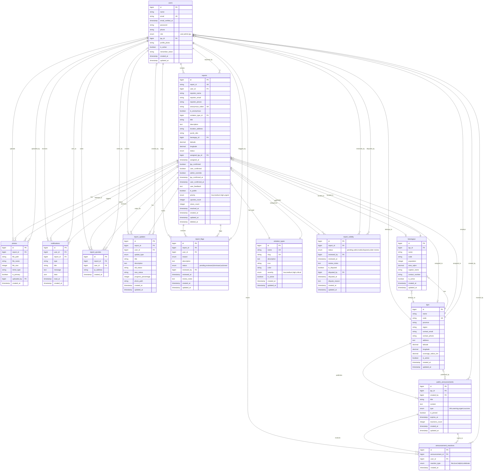

# EcoWatch-F Entity Relationship Diagram (ERD)

## Visual ERD



---

## Detailed Table Descriptions

### Core Tables

#### 1. users
**Purpose**: User authentication and role management

**Key Fields**:
- `role`: Determines access level (user, admin, lgu)
- `lgu_id`: Links LGU staff to their office
- `is_active`: Account status flag

**Relationships**:
- Belongs to one LGU (if role is 'lgu')
- Has many reports, notifications, upvotes, flags
- Creates report updates and announcements

---

#### 2. lgus (Local Government Units)
**Purpose**: Government offices that handle reports

**Key Fields**:
- `code`: Unique identifier (e.g., "DVO" for Davao)
- `latitude`, `longitude`: Geographic location
- `coverage_radius_km`: Service area (default 10km)

**Relationships**:
- Has many users (staff members)
- Has many barangays
- Has many assigned reports
- Publishes announcements

---

#### 3. violation_types
**Purpose**: Categories of environmental violations

**Key Fields**:
- `slug`: URL-friendly identifier
- `severity`: Impact level (low, medium, high, critical)
- `icon`, `color`: UI display properties

**Relationships**:
- Has many reports

**Default Types**:
1. Illegal Dumping
2. Water Pollution
3. Air Pollution
4. Deforestation
5. Noise Pollution
6. Soil Contamination
7. Wildlife Violations
8. Industrial Violations

---

#### 4. reports (MAIN TABLE)
**Purpose**: Core table for environmental violation reports

**Key Fields**:
- `report_id`: Human-readable ID (e.g., "RPT-001")
- `is_anonymous`: Allows anonymous reporting
- `anonymous_token`: Tracking token for anonymous users
- `status`: Workflow state (pending → in-review → in-progress → awaiting-confirmation → resolved)
- `lgu_confirmed`, `user_confirmed`, `admin_override`: Three-way resolution system
- `upvotes_count`: Community engagement metric

**Status Flow**:
```
pending → in-review → in-progress → awaiting-confirmation → resolved
                                  ↘ rejected
```

**Relationships**:
- Belongs to user (reporter), violation_type, barangay, assigned LGU
- Has many photos, notifications, updates, upvotes, flags
- Has one validity record

---

### Supporting Tables

#### 5. barangays
**Purpose**: Sub-municipal geographic divisions

**Key Fields**:
- `lgu_id`: Parent LGU
- `population`, `area_sqkm`: Demographic data
- `captain_name`, `contact_number`: Local leadership

**Relationships**:
- Belongs to one LGU
- Has many reports

---

#### 6. photos
**Purpose**: Evidence images for reports

**Key Fields**:
- `is_primary`: Main display image flag
- `file_size`, `mime_type`: File metadata

**Relationships**:
- Belongs to one report
- Uploaded by one user (optional)

---

#### 7. notifications
**Purpose**: User alert system

**Key Fields**:
- `type`: Notification category
- `data`: JSON payload for additional context
- `read_at`: Read status tracking

**Relationships**:
- Sent to one user
- About one report (optional)

---

#### 8. report_validity
**Purpose**: Report verification and dispute system

**Key Fields**:
- `status`: pending, valid, invalid, disputed, under-review
- `is_disputed`: Dispute flag
- `dispute_reason`: User's explanation

**Workflow**:
1. Admin reviews → marks valid/invalid
2. User can dispute invalid reports
3. Admin must re-review disputes

**Relationships**:
- Validates one report
- Reviewed by one user (admin/lgu)
- Disputed by one user (reporter)

---

#### 9. report_updates
**Purpose**: Unified timeline for all report activities

**Key Fields**:
- `update_type`: status_change, assignment, progress, resolution, note, verification
- `progress_percentage`: 0-100 for progress updates
- `old_status`, `new_status`: For status changes

**Replaces**: Previously separate tables (status_history, report_actions, comments)

**Relationships**:
- Tracks one report
- Created by one user

---

#### 10. report_upvotes
**Purpose**: Community voting system

**Key Fields**:
- `user_id`: For logged-in users (nullable)
- `ip_address`: For anonymous voters

**Features**:
- Prevents duplicate votes (unique constraint on report_id + user_id/ip_address)
- Supports both authenticated and anonymous voting

**Relationships**:
- Votes for one report
- Voted by one user (optional)

---

#### 11. report_flags
**Purpose**: Report inappropriate content

**Key Fields**:
- `reason`: spam, inappropriate, duplicate, false_information, other
- `status`: pending, reviewed, dismissed, actioned
- `reviewed_by`: Admin who handled the flag

**Relationships**:
- Flags one report
- Flagged by one user
- Reviewed by one user (admin)

---

#### 12. public_announcements
**Purpose**: LGU and admin public communications

**Key Fields**:
- `type`: info, warning, urgent, success
- `is_pinned`: Priority display
- `expires_at`: Auto-hide date
- `reactions_count`: Engagement metric

**Relationships**:
- Published by one LGU (optional - can be system-wide)
- Created by one user (admin/lgu)
- Has many reactions

---

#### 13. announcement_reactions
**Purpose**: User engagement with announcements

**Key Fields**:
- `reaction_type`: like, love, helpful, celebrate

**Relationships**:
- Reacts to one announcement
- Reacted by one user

---

## Key Relationships Summary

### One-to-Many Relationships
- `users` → `reports` (reporter)
- `users` → `notifications`
- `users` → `report_upvotes`
- `lgus` → `users` (staff)
- `lgus` → `barangays`
- `lgus` → `reports` (assigned)
- `lgus` → `public_announcements`
- `reports` → `photos`
- `reports` → `report_updates`
- `reports` → `report_upvotes`
- `reports` → `report_flags`
- `public_announcements` → `announcement_reactions`

### One-to-One Relationships
- `reports` ↔ `report_validity`

### Many-to-One Relationships
- `reports` → `violation_types`
- `reports` → `barangays`
- `barangays` → `lgus`
- `photos` → `users` (uploader)
- `notifications` → `reports`

---

## Database Indexes

### Performance Optimization

**users**:
- `email` (unique)
- `role`
- `lgu_id`
- `is_active`

**reports**:
- `report_id` (unique)
- `user_id`
- `violation_type_id`
- `status`
- `assigned_lgu_id`
- `barangay_id`
- `created_at`
- `is_public`
- `is_anonymous`

**notifications**:
- `user_id`
- `report_id`
- `read_at`
- Composite: `(user_id, read_at)`

**report_upvotes**:
- Unique: `(report_id, user_id)`
- Unique: `(report_id, ip_address)`

**report_flags**:
- `report_id`
- `user_id`
- `status`

---

## Special Features

### 1. Anonymous Reporting
- Set `is_anonymous = true`
- Generate unique `anonymous_token`
- `user_id` is nullable
- Token allows anonymous users to track their reports

### 2. Three-Way Resolution System
```
LGU marks fixed → lgu_confirmed = true
User confirms → user_confirmed = true
Admin override → admin_override = true (bypasses user confirmation)
```

### 3. Auto-Assignment Algorithm
Uses Haversine formula to calculate distance:
1. Get report latitude/longitude
2. Find nearest LGU within coverage radius
3. Auto-assign to that LGU
4. Create notification for LGU staff

### 4. Soft Deletes
- `reports` table uses `deleted_at`
- Allows data recovery
- Maintains referential integrity

### 5. Community Engagement
- **Upvoting**: Both users and anonymous visitors
- **Flagging**: Report inappropriate content
- **Reactions**: Engage with announcements
- **Validity Disputes**: Challenge invalid markings

---

## Data Flow Examples

### Report Submission Flow
```
1. User submits form
   ↓
2. Create report record
   ↓
3. Upload photos → photos table
   ↓
4. Calculate nearest LGU → update assigned_lgu_id
   ↓
5. Create validity record (status: pending)
   ↓
6. Create notification for LGU
   ↓
7. Create report_update (type: assignment)
```

### Resolution Flow
```
1. LGU marks as fixed
   ↓ lgu_confirmed = true, status = 'awaiting-confirmation'
   ↓
2. Create notification for user
   ↓
3. User confirms resolution
   ↓ user_confirmed = true, status = 'resolved'
   ↓
4. Create report_update (type: resolution)
   ↓
5. Update resolved_at timestamp
```

### Dispute Flow
```
1. Admin marks report invalid
   ↓ report_validity.status = 'invalid'
   ↓
2. User disputes
   ↓ is_disputed = true, status = 'disputed'
   ↓
3. Admin re-reviews
   ↓ status = 'under-review'
   ↓
4. Final decision
   ↓ status = 'valid' or 'invalid'
```

---

## Statistics

- **Total Tables**: 17 (13 core + 4 Laravel system tables)
- **Foreign Keys**: 25+
- **Enum Fields**: 7
- **Boolean Flags**: 12
- **Timestamp Fields**: 30+
- **Unique Constraints**: 8

---

## Notes for Developers

### Cascade Rules
- `reports` → `photos`: CASCADE DELETE
- `reports` → `notifications`: CASCADE DELETE
- `reports` → `report_updates`: CASCADE DELETE
- `reports` → `report_upvotes`: CASCADE DELETE
- `lgus` → `barangays`: CASCADE DELETE
- `users` → `reports`: SET NULL (preserve reports if user deleted)

### Nullable Foreign Keys
- `reports.user_id` (anonymous reports)
- `reports.barangay_id` (location may be outside barangays)
- `reports.assigned_lgu_id` (unassigned reports)
- `photos.uploaded_by` (anonymous uploads)
- `notifications.report_id` (system notifications)

### Enum Values
Must match application logic:
- **user.role**: user, admin, lgu
- **violation_types.severity**: low, medium, high, critical
- **reports.status**: pending, in-review, in-progress, awaiting-confirmation, resolved, rejected
- **reports.priority**: low, medium, high, urgent
- **report_validity.status**: pending, valid, invalid, disputed, under-review
- **report_updates.update_type**: status_change, assignment, progress, resolution, note, verification
- **public_announcements.type**: info, warning, urgent, success

---

## Version History

- **v1.0** (Dec 6, 2024): Initial schema with 11 core tables
- **v1.1** (Dec 7, 2024): Added purok_sitio field to reports
- **v1.2** (Dec 8, 2024): Added upvotes/downvotes system
- **v1.3** (Dec 9, 2024): Removed downvotes, added report_flags table
- **v1.4** (Dec 9, 2024): Added announcement_reactions system

---

## Conclusion

This ERD represents a comprehensive environmental reporting system with:
- ✅ Role-based access control
- ✅ Anonymous reporting capability
- ✅ Geographic auto-assignment
- ✅ Three-way resolution verification
- ✅ Community engagement features
- ✅ Audit trail and timeline
- ✅ Dispute resolution system
- ✅ Public communication channels

The design prioritizes simplicity, data integrity, and user experience while maintaining flexibility for future enhancements.
